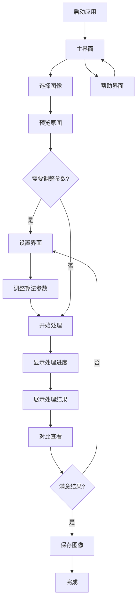

# 非均质有雾图像去雾应用产品需求文档

## 1. 产品概述

本项目旨在开发一个专业的非均质有雾图像去雾桌面应用程序，通过自主研发的图像处理算法，为用户提供高质量的图像去雾服务。

该应用程序解决了传统去雾算法在处理非均质雾霾图像时效果不佳的问题，主要面向摄影师、图像处理专业人员和普通用户，帮助他们快速获得清晰的图像效果。

产品目标是成为市场上领先的专业图像去雾工具，提供简洁易用的界面和卓越的处理效果。

## 2. 核心功能

### 2.1 用户角色

本应用为单用户桌面应用程序，无需用户注册和登录，所有用户享有相同的功能权限。

### 2.2 功能模块

我们的非均质有雾图像去雾应用包含以下主要页面：

1. **主界面**：图像选择区域、原图预览区域、处理结果展示区域、操作控制面板
2. **设置界面**：算法参数调整、输出格式设置、界面主题配置
3. **帮助界面**：使用说明、算法介绍、常见问题解答

### 2.3 页面详情

| 页面名称 | 模块名称 | 功能描述 |
|----------|----------|----------|
| 主界面 | 图像选择区域 | 提供文件选择按钮，支持常见图像格式（JPG、PNG、BMP、TIFF）的导入 |
| 主界面 | 原图预览区域 | 显示选中的有雾图像，支持缩放和平移查看 |
| 主界面 | 处理结果展示区域 | 实时显示去雾处理后的图像效果，支持对比查看 |
| 主界面 | 操作控制面板 | 包含开始处理、保存结果、重置操作等核心功能按钮 |
| 主界面 | 进度显示 | 显示图像处理进度条和状态信息 |
| 设置界面 | 算法参数调整 | 提供去雾强度、对比度增强、色彩饱和度等参数的精细调节 |
| 设置界面 | 输出设置 | 配置输出图像的格式、质量和分辨率 |
| 设置界面 | 界面配置 | 选择界面主题、语言设置、默认保存路径 |
| 帮助界面 | 使用指南 | 详细的操作步骤说明和最佳实践建议 |
| 帮助界面 | 算法说明 | 介绍非均质有雾图像处理算法的原理和特点 |
| 帮助界面 | 技术支持 | 常见问题解答和联系方式 |

## 3. 核心流程

**主要用户操作流程：**

1. 用户启动应用程序，进入主界面
2. 点击图像选择按钮，从本地文件系统选择有雾图像
3. 系统在原图预览区域显示选中的图像
4. 用户可选择进入设置界面调整算法参数（可选）
5. 点击开始处理按钮，系统运行去雾算法
6. 处理过程中显示进度条和状态信息
7. 处理完成后，在结果展示区域显示去雾后的图像
8. 用户可对比查看原图和处理结果
9. 满意后点击保存按钮，选择输出路径和格式
10. 系统保存处理结果，显示保存成功提示

## 4. 用户界面设计

### 4.1 设计风格

- **主色调**：深蓝色 (#2C3E50) 作为主色，浅灰色 (#ECF0F1) 作为背景色
- **辅助色**：绿色 (#27AE60) 用于成功状态，橙色 (#F39C12) 用于警告，红色 (#E74C3C) 用于错误
- **按钮样式**：现代扁平化设计，圆角矩形，悬停时有轻微阴影效果
- **字体**：主要使用微软雅黑 14px，标题使用 18px 加粗
- **布局风格**：采用网格布局，左右分栏设计，顶部工具栏导航
- **图标风格**：使用简洁的线性图标，统一的视觉风格

### 4.2 页面设计概览

| 页面名称 | 模块名称 | UI元素 |
|----------|----------|--------|
| 主界面 | 图像选择区域 | 大型虚线边框的拖拽区域，中央显示文件夹图标和"选择图像"文字，支持拖拽上传 |
| 主界面 | 原图预览区域 | 左侧面板，白色背景，图像居中显示，底部显示图像信息（尺寸、格式） |
| 主界面 | 处理结果展示区域 | 右侧面板，与原图区域对称设计，支持缩放和全屏查看 |
| 主界面 | 操作控制面板 | 底部横向布局，包含主要操作按钮，使用品牌色彩区分功能重要性 |
| 主界面 | 进度显示 | 顶部状态栏，蓝色进度条，右侧显示百分比和处理状态文字 |
| 设置界面 | 参数调整面板 | 左侧垂直标签页，右侧对应参数滑块和数值输入框，实时预览效果 |
| 帮助界面 | 内容展示区域 | 中央内容区域，使用卡片式布局，清晰的层次结构和导航 |

### 4.3 响应式设计

应用程序采用桌面优先设计，最小窗口尺寸为 1024x768 像素，支持窗口缩放和最大化。界面元素会根据窗口大小自适应调整，确保在不同分辨率下都能提供良好的用户体验。