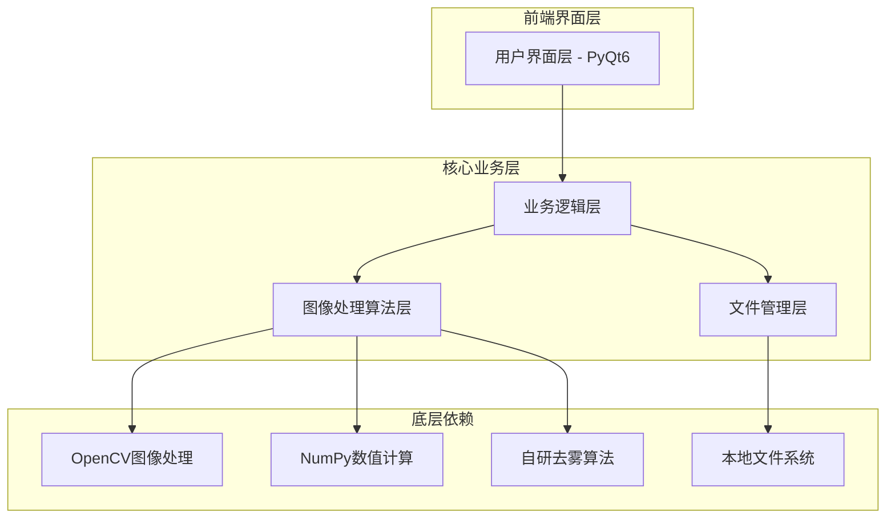
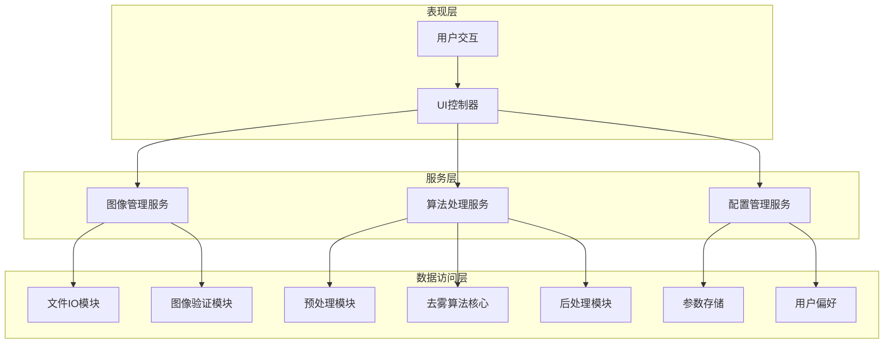
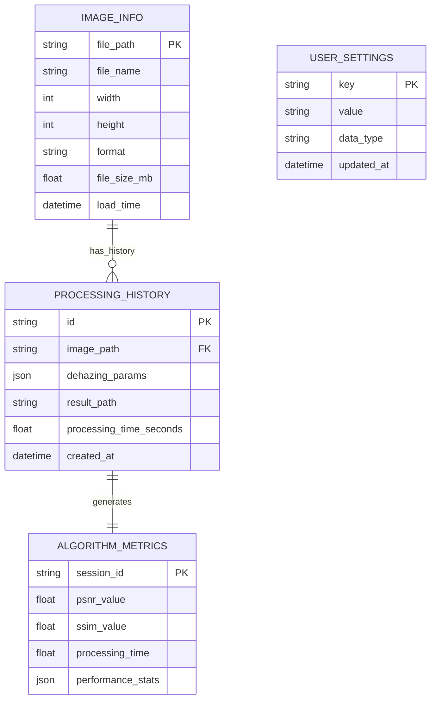

# 非均质有雾图像去雾应用技术架构文档

## 1. 架构设计



## 2. 技术描述

- **前端界面**：PyQt6 + Qt Designer
- **图像处理**：OpenCV 4.8+ + NumPy 1.24+ + Pillow 10.0+
- **算法实现**：自研非均质有雾图像处理算法 + SciPy科学计算
- **打包部署**：PyInstaller
- **开发工具**：Python 3.9+

## 3. 路由定义

| 界面路由 | 用途 |
|----------|------|
| MainWindow | 主界面，包含图像选择、预览、处理和结果展示功能 |
| SettingsDialog | 设置对话框，提供算法参数调整和应用配置 |
| HelpDialog | 帮助对话框，显示使用说明和算法介绍 |
| ProgressDialog | 进度对话框，显示图像处理进度和状态信息 |
| AboutDialog | 关于对话框，显示应用版本和开发者信息 |

## 4. API定义

### 4.1 核心API

**图像处理相关**

```python
class ImageProcessor:
    def load_image(self, file_path: str) -> np.ndarray:
        """加载图像文件"""
        pass
    
    def dehaze_image(self, image: np.ndarray, params: DehazingParams) -> np.ndarray:
        """执行去雾处理"""
        pass
    
    def save_image(self, image: np.ndarray, file_path: str, quality: int = 95) -> bool:
        """保存处理后的图像"""
        pass
```

**参数定义**

```python
@dataclass
class DehazingParams:
    """去雾算法参数"""
    intensity: float = 0.8  # 去雾强度 (0.0-1.0)
    contrast_enhancement: float = 1.2  # 对比度增强 (0.5-2.0)
    saturation_boost: float = 1.1  # 饱和度提升 (0.5-2.0)
    preserve_details: bool = True  # 是否保持细节
    adaptive_processing: bool = True  # 是否启用自适应处理
```

**界面控制相关**

```python
class MainController:
    def select_image(self) -> str:
        """选择图像文件"""
        pass
    
    def process_image(self, callback: Callable[[float], None]) -> None:
        """处理图像，支持进度回调"""
        pass
    
    def export_result(self, file_path: str) -> bool:
        """导出处理结果"""
        pass
```

## 5. 服务架构图



## 6. 数据模型

### 6.1 数据模型定义



### 6.2 数据定义语言

**配置文件结构 (JSON)**

```json
{
  "app_settings": {
    "theme": "light",
    "language": "zh_CN",
    "default_save_path": "./output",
    "auto_save_enabled": true,
    "max_image_size_mb": 50
  },
  "algorithm_defaults": {
    "intensity": 0.8,
    "contrast_enhancement": 1.2,
    "saturation_boost": 1.1,
    "preserve_details": true,
    "adaptive_processing": true
  },
  "ui_preferences": {
    "window_width": 1200,
    "window_height": 800,
    "preview_zoom_level": 1.0,
    "show_processing_details": false
  }
}
```

**处理历史记录结构**

```python
class ProcessingRecord:
    """图像处理记录"""
    def __init__(self):
        self.id: str = str(uuid.uuid4())
        self.original_image_path: str = ""
        self.result_image_path: str = ""
        self.parameters: DehazingParams = DehazingParams()
        self.processing_time: float = 0.0
        self.quality_metrics: Dict[str, float] = {}
        self.timestamp: datetime = datetime.now()
```

**算法性能指标**

```python
class PerformanceMetrics:
    """算法性能评估指标"""
    def __init__(self):
        self.psnr: float = 0.0  # 峰值信噪比
        self.ssim: float = 0.0  # 结构相似性指数
        self.processing_time: float = 0.0  # 处理时间(秒)
        self.memory_usage_mb: float = 0.0  # 内存使用量
        self.cpu_usage_percent: float = 0.0  # CPU使用率
```